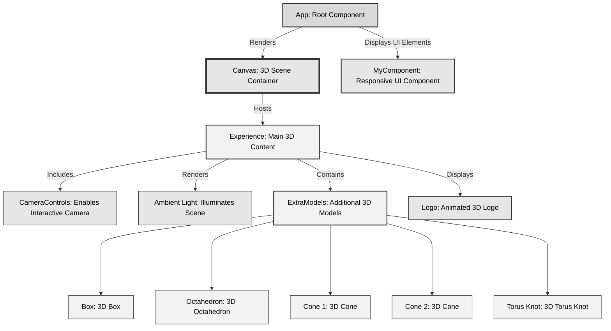

  

This interactive 3D wallpaper app, powered by React Three Fiber, offers a captivating visual experience with dynamic, responsive elements tailored for desktop and mobile devices. Engage with beautifully rendered 3D models and animations for a unique, immersive digital environment.

# App Structure 

# 🔶 App Component Overview

The `App` component serves as the entry point for the interactive 3D wallpaper application built with React and React Three Fiber. It orchestrates the rendering of the 3D scene, managing state for user interactions and responsive design adjustments based on device type.

## Key Features

- **Dynamic Canvas Class**: Adjusts the canvas styling based on touch interactions, enhancing the user experience on touch devices.
- **Responsive Design**: Dynamically updates the canvas's class name and interaction settings based on the device type (mobile, tablet, desktop).
- **Touch Interaction**: Implements custom touch start and end event handlers to toggle a control switch and update the canvas's appearance and behavior accordingly.

## Components

- `Canvas` from `@react-three/fiber`: Renders the 3D scene and hosts the `Experience` component.
- `Experience`: Contains the main 3D content, including models and animations.
- `MyComponent`: Used to display the way user is supposed to interact with the Experience. 

## Interaction Logic

The component detects two-touch gestures, enabling specific features or altering the canvas's style to reflect the current interaction mode. It showcases the integration of React Three Fiber within a responsive and interactive React application.

# 🔶 Experience Component Overview

The `Experience` component is central to the interactive 3D wallpaper application, leveraging React Three Fiber for rendering and @react-three/drei for enhanced functionality.

## Key Features

- **Device Type Detection**: Dynamically adjusts settings and camera positions based on the user's device, optimizing the experience for mobile, tablet, and desktop.
- **Responsive Camera Controls**: Customizes camera control settings to suit the interaction capabilities of different devices, including touch and mouse inputs.
- **Animation State Management**: Controls the animation flow and timing within the 3D scene, enhancing the visual experience.

## Components and Hooks

- `CameraControls` from `@react-three/drei`: Provides interactive camera control within the 3D scene.
- `useThree` from `@react-three/fiber`: Accesses the Three.js renderer's state and methods.
- `useState` and `useEffect` from React: Manages state and lifecycle events for responsive design and settings application.

## Interaction and Responsiveness

Adjusts interactive capabilities and visual presentation based on the detected device type, ensuring a seamless and engaging user experience across different platforms.

# 🔶 ExtraModels Component Overview

`ExtraModels` enriches the 3D scene with additional geometries and animations, demonstrating the power of React Three Fiber and @react-three/drei for creating dynamic and interactive 3D content.

## Key Features

- **Responsive Positioning**: Adjusts the positions of various 3D models based on the device type, ensuring optimal visibility and interaction on mobile, tablet, and desktop devices.
- **Animated Models**: Utilizes `@react-spring/three` for smooth and engaging animations, bringing life to the 3D models with scale transformations.

## Models and Animations

- Various geometric shapes (box, octahedron, cones, torus knot) are rendered with unique positions and animations.
- Uses `MeshWobbleMaterial` for a dynamic, wireframe appearance that reacts to the scene's animation.

## Responsiveness and Interactivity

The component's design and functionality showcase how device-specific adjustments and animations can enhance the user experience in a 3D web application.

# 🔶 MyComponent Overview

`MyComponent` demonstrates responsive design within the 3D wallpaper application, offering a UI element that adjusts based on the user's device type.

## Key Features

- **Device-Specific Content**: Displays different SVG icons for desktop and mobile/tablet users, enhancing the user experience by acknowledging the interaction context.
- **Animation and Styling**: Implements fading and scaling animations using `@react-spring/web`, adding visual interest and feedback to the user interface.

## Implementation Details

- Uses `useState` and `useEffect` hooks for responsive design, detecting screen size changes and adjusting content accordingly.
- Animated transitions provide a smooth and visually appealing way to present information relevant to the user's device.

## User Interaction

The component enriches the application by providing contextual visual cues about the interaction modes supported on the user's current device, fostering an intuitive and engaging user experience.

# 🔶 Logo Component Overview

The `Logo` component showcases the use of 3D models within the React Three Fiber framework, featuring an animated logo that adds brand identity and visual appeal to the 3D wallpaper application.

## Key Features

- **3D Model Integration**: Utilizes `useGLTF`

